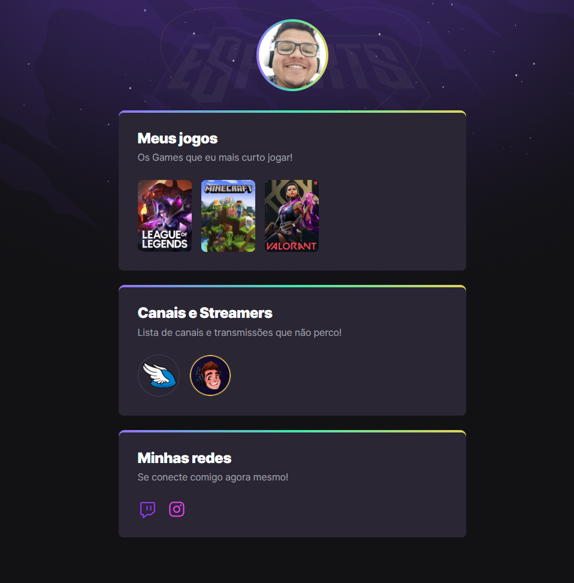

#NLW eSport

>Trilha Explorer

Projeto construido do evento Next Level Week da Rocketseat.

🔗 [Clique aqui para acessar](https://soulsouza.github.io/landingPage_eSport/)

## 🚀 Tecnologias

- HTML
- CSS
- Git e Github

## O que aprendi com esse evento?

- Uma forma facil de usar o Grid e o Flex para posicionar os elementos na pagina.

- Usar o Git junto ao Vs Code.

- Usando o Github para hospedar e mostrar os projetos para consultas e epresenta-los.

## contato

@josephNsouza